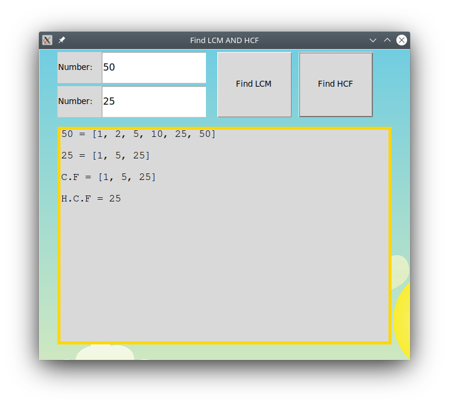
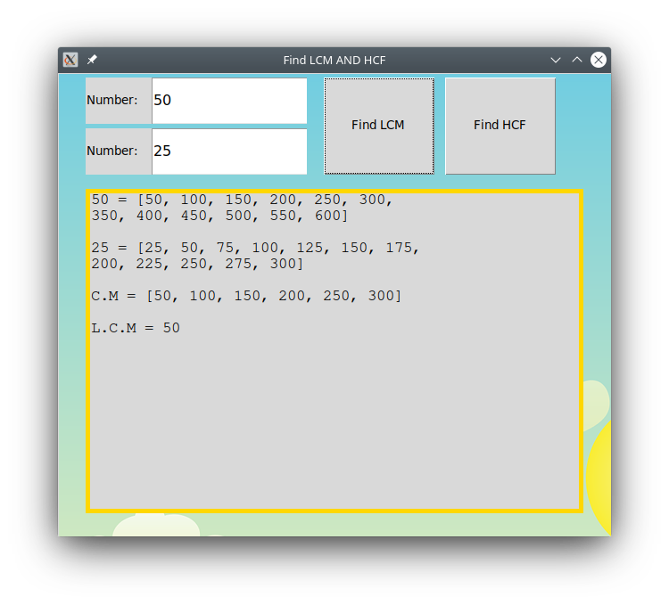

# lcm-and-hcf
Find LCM and HCF

# Dependence 
1.) Tkinter

# Run 
<h3>How to install tkinter</h1>
<h4>On Linux</h4>
    ```shell
    sudo apt-get install python3-tk
    python3 main.py
    ```

<h4>On Windows</h4>
```shell
    pip install tkinter
    python main.py or python3 main.py
```


# Screenshot

<br>


# Social Media
Facebook --- Tiki Vega
